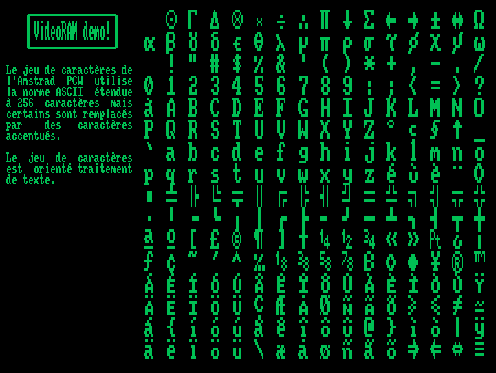

videoram
========

`videoram.c` is a small C library that directly manipulates the Amstrad PCW
video RAM.

Compiling
=========

You need z88dk to compile this project.

Just type `make` in the project directory. It will generate `demo.com`.

Screenshot
==========

